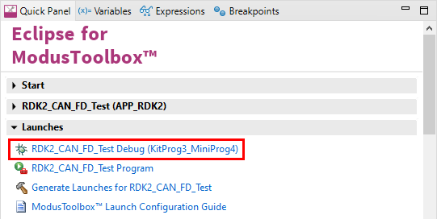

# RDK2 CAN FD Test

Rutronik Development Kit Programmable System-on-Chip CY8C6245AZI-S3D72 "CAN FD Test" Example. 

This example is used for CAN FD peripheral testing.

 

## Requirements

- [ModusToolbox® software](https://www.infineon.com/cms/en/design-support/tools/sdk/modustoolbox-software/) v3.0

### Using the code example with a ModusToolbox IDE:

1. Import the project: **File** > **Import...** > **General** > **Existing Projects into Workspace** > **Next**.
2. Select the directory where **"RDK2_CANFD_Test"** resides and click  **Finish**.
3. Update libraries using  a **"Library Manager"** tool.
4. Select and build the project **Project ** > **Build Project**.

### Operation

The firmware example uses KitProg3 Debug UART for debug output. The CAN FD is initialized to work in a external loop-back test mode, hence all sent packages are received back to the MCU.

 The differential data signals also can be seen on the CAN+ and CAN- terminals . The termination 120 Ohm resistor must be enabled by shorting a solder  bridge **SB5**.

### Debugging

If you successfully have imported the example, the debug configurations are already prepared to use with a the KitProg3, MiniProg4, or J-link. Open the ModusToolbox perspective and find the Quick Panel. Click on the desired debug launch configuration and wait for the programming to complete and debugging process to start.

## Legal Disclaimer

The evaluation board including the software is for testing purposes only and, because it has limited functions and limited resilience, is not suitable for permanent use under real conditions. If the evaluation board is nevertheless used under real conditions, this is done at one’s responsibility; any liability of Rutronik is insofar excluded. 

